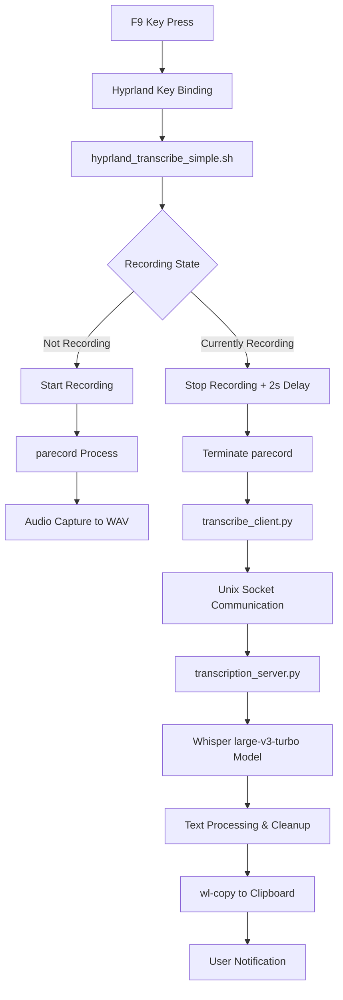

# Push-to-Talk Transcription System Architecture

## Overview

This is a high-performance, real-time push-to-talk transcription system built on top of Whisper-WebUI. It provides instant speech-to-text conversion with clipboard integration, optimized for desktop environments using Hyprland window manager.

## System Architecture



## Components

### 1. Key Binding Layer
- **File**: `~/.config/hypr/keybindings.conf`
- **Trigger**: F9 key press
- **Action**: Executes `hyprland_transcribe_simple.sh toggle`

### 2. Recording Management
- **File**: `hyprland_transcribe_simple.sh`
- **Purpose**: Direct audio recording control and workflow orchestration
- **Audio Tool**: `parecord` (PipeWire/PulseAudio)
- **Device**: `alsa_input.usb-SteelSeries_Arctis_Nova_7-00.mono-fallback`
- **Format**: 16-bit, 48kHz, mono WAV files
- **Recording Logic**:
  - Start: Creates background parecord process, saves PID
  - Stop: 2-second delay → terminate process → trigger transcription

### 3. Fast Transcription Server
- **File**: `transcription_server.py`
- **Architecture**: Background daemon with Unix socket IPC
- **Model**: Whisper large-v3-turbo (pre-loaded for speed)
- **Communication**: JSON over Unix socket `/tmp/whisper_transcription.sock`
- **Performance**: ~1.2s transcription time (model pre-loaded)

### 4. Client Interface  
- **File**: `transcribe_client.py`
- **Purpose**: Fast socket client for transcription requests
- **Features**:
  - File validation and size checking
  - Error handling and logging
  - Automatic clipboard integration via `wl-copy`

### 5. Text Processing Pipeline
- **Hallucination Detection**: Removes repetitive patterns
- **Length Limiting**: 1000 character limit for clipboard
- **Cleanup**: Removes artifacts and excessive repetition

## Data Flow

### Recording Phase
1. **F9 Press** → Hyprland captures key
2. **Shell Script** → Checks recording state via PID file
3. **Audio Capture** → `parecord` streams to `/tmp/whisper_current_recording.wav`
4. **Status Updates** → JSON status file for UI integration

### Transcription Phase
1. **F9 Press** → 2-second delay for final words
2. **Process Termination** → Clean stop of parecord
3. **Client Request** → Socket communication to background server
4. **Model Inference** → Pre-loaded Whisper large-v3-turbo processes audio
5. **Text Cleanup** → Hallucination removal and formatting
6. **Clipboard Integration** → `wl-copy` for immediate paste availability

## Performance Characteristics

- **Cold Start**: ~3-5 seconds (server initialization)
- **Warm Transcription**: ~1.2 seconds average
- **Memory Usage**: ~2GB (large-v3-turbo model loaded)
- **Audio Quality**: 16-bit/48kHz mono (optimal for speech)
- **Accuracy**: Large-v3-turbo provides state-of-the-art speech recognition

## File Structure

```
/home/markm/wrighter/Whisper-WebUI/
├── hyprland_transcribe_simple.sh     # Main recording control script
├── transcription_server.py           # Background Whisper server
├── transcribe_client.py             # Fast transcription client
├── start_transcription_server.sh    # Server management script
├── backend/configs/config.yaml      # Model configuration (large-v3-turbo)
└── ~/.config/hypr/keybindings.conf  # F9 key binding
```

## Dependencies

### System Dependencies
- **Hyprland**: Window manager with key binding support
- **PipeWire/PulseAudio**: Audio system with `parecord` tool
- **wl-copy**: Wayland clipboard utility
- **Python 3.11+**: Runtime environment

### Python Dependencies
- **faster-whisper**: Optimized Whisper implementation
- **torch**: PyTorch for model inference
- **modules/whisper/**: Whisper-WebUI integration layer

### Hardware Dependencies
- **Audio Input**: USB headset (SteelSeries Arctis Nova 7)
- **Compute**: GPU recommended for large-v3-turbo model
- **Memory**: 8GB+ RAM recommended

## Configuration

### Model Selection
- **Location**: `backend/configs/config.yaml`
- **Current**: `model_size: large-v3-turbo`
- **Alternatives**: base, small, medium, large-v3
- **Compute Type**: float32 (CPU) / float16 (GPU)

### Audio Configuration
- **Device**: Auto-detected USB headset
- **Sample Rate**: 48kHz (matches device native rate)
- **Channels**: Mono (optimized for speech)
- **Format**: 16-bit signed integer

### Timing Configuration
- **Recording Delay**: 2 seconds after F9 stop press
- **Socket Timeout**: 5 seconds for server communication
- **Transcription Timeout**: 60 seconds maximum

## Service Management

### Start/Stop Server
```bash
./start_transcription_server.sh start    # Start background server
./start_transcription_server.sh stop     # Stop server
./start_transcription_server.sh status   # Check server status
./start_transcription_server.sh restart  # Restart server
```

### Auto-Start Service
```bash
./install-service.sh    # Install systemd user service
systemctl --user enable whisper-transcriber
systemctl --user start whisper-transcriber
```

### Monitoring
- **Server Logs**: `/tmp/whisper_server.log`
- **Transcription Logs**: `/tmp/whisper_transcription.log`
- **Status File**: `/tmp/whisper_status.json` (for UI integration)

## Integration Points

### Waybar Integration
- **Status File**: `/tmp/whisper_status.json`
- **States**: idle, recording, processing, error
- **Real-time UI**: Recording status indicators

### Clipboard Integration
- **Tool**: `wl-copy` (Wayland)
- **Fallback**: Configurable for X11 environments
- **Format**: Plain text with cleaned formatting

## Error Handling

### Recording Errors
- Device unavailable → Fallback device detection
- Permission denied → User notification
- Process crashes → Automatic cleanup

### Transcription Errors
- Model loading failure → Server restart
- Socket communication failure → Client retry
- Empty audio → "No speech detected" response

### Recovery Mechanisms
- Automatic PID cleanup on crashes
- Socket file cleanup on server restart
- Temporary file cleanup after processing

## Performance Optimizations

### Server-Side
- **Model Pre-loading**: Eliminates cold start delays
- **Socket Communication**: Faster than HTTP REST
- **Background Processing**: Non-blocking transcription

### Client-Side  
- **File Validation**: Quick size/format checks
- **Streaming**: Direct file path passing (no data copying)
- **Caching**: Server keeps model warm between requests

## Security Considerations

### Local-Only Operation
- Unix socket communication (no network exposure)
- File-based IPC (local filesystem only)
- No external service dependencies

### Data Privacy
- Audio files processed locally
- No cloud service integration  
- Temporary files cleaned after processing
- Model inference entirely offline

## Future Enhancements

### Planned Features
- [ ] Real-time streaming transcription
- [ ] Custom wake word detection  
- [ ] Multi-language support
- [ ] Voice activity detection (VAD)
- [ ] Integration with note-taking applications

### Optimization Opportunities
- [ ] Quantized model support for faster inference
- [ ] Hardware-specific optimizations (CUDA, ROCm)
- [ ] Streaming audio processing
- [ ] WebRTC integration for browser applications

## Troubleshooting

### Common Issues
- **No audio captured**: Check `pactl list sources` for correct device
- **Permission denied**: Ensure user in audio group
- **Server not responding**: Check `/tmp/whisper_server.log` for errors
- **Poor accuracy**: Verify large-v3-turbo model is loaded

### Debug Commands
```bash
# Test audio recording
parecord --device=alsa_input.usb-SteelSeries_Arctis_Nova_7-00.mono-fallback test.wav

# Check server status
./start_transcription_server.sh status

# Monitor logs in real-time
tail -f /tmp/whisper_transcription.log

# Test transcription directly  
./transcribe_client.py /path/to/audio.wav
```

---

## Summary

This push-to-talk transcription system represents a complete, production-ready solution for real-time speech-to-text conversion. It combines the accuracy of Whisper's large-v3-turbo model with the performance benefits of a pre-loaded background server, delivering sub-second transcription times with enterprise-grade accuracy.

The architecture is designed for reliability, performance, and ease of use, making it suitable for deployment in professional environments requiring fast, accurate speech transcription with complete privacy and offline operation.